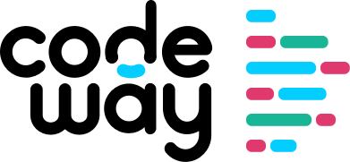

<h3 align="center">
  
</h3>

# CodeWăy 2016: presentation resources

This repository keeps the resources used in CodeWay'16 presentations. Resources include presentation slides, diagrams, and links to the code used for demos.

### Presentations

|            Intermediate Topics           |                       Advanced Topics                       |
|------------------------------------------|-------------------------------------------------------------|
|[Dependency Injection Made Simple](Intermediate-topics/Dependency-Injection-Made-Simple) |[Optical Swift - Embracing functional references](Advanced-topics/Optical-Swift)|
|[Functors and Monads, How to?](Intermediate-topics/Functors-and-Monads-How-to) |[Comparison of different continuous integration services](Advanced-topics/Comparison-of-Different-Continuous-Integration-Services)|
|[Maintainability in Mobile](Intermediate-topics/Maintainability-in-Mobile) |[Reactive programming with RxSwift](Advanced-topics/Reactive-Programming-with-RxSwift)|
|[The Pursuit of Happyness: iOS vs Android](Intermediate-topics/Android-vs-iOS) |[Software design](Advanced-topics/Software-Design)|
|[Objective C is not dead!](Intermediate-topics/Objective-C-Is-Not-Dead) |[Product Centric Engineering](Advanced-topics/Product-Centric-Engineering)|
|[iMessage + Apps = Interactive Messages](Intermediate-topics/iMessage-Apps-Interactive-Messages) |[IoT under iOS control](Advanced-topics/IoT-Under-iOS-Control)|
|[CDD - Client Driven Development](Intermediate-topics/CDD-Client-Driven-Development) |[Architect application in a functional way](Advanced-topics/Functional-Routing)|
|[Abstract relationships in Swift](Intermediate-topics/Abstract-Relationships-in-Swift) |[Rich mobile video experiences: challenges and opportunities](Advanced-topics/Rich-Mobile-Video-Experiences)|

### About CodeWăy

CodeWăy is a mobile conference organized by developers for developers proudly supported by YOPESO.  
As in original form:  
> CodeWăy vine ca un răspuns la intrebarea curioasă "Cum ar fi să organizăm o conferință aici, pentru developerii din Moldova? Să povestim despre ce învățăm noi și să îi intrigăm și pe ceilalți...?". Așa am inceput anul trecut împreună cu Dan, Oleg și Serghei, cu putină experiență în a organiza conferințe, dar cu mult suflet și entuziasm. Asta ne-a dat șansa de a vedea cum stau lucrurile de partea cealalta a microfonului, și de a înțelege că microfonul trebuie și ținut cumva. 🤓  
> Mă bucur că avem suportul YOPESO și am putut organiza și a doua ediție CodeWăy, mai mare, mai variată și cu la fel de mult suflet. Invățăm multe lucruri la fiecare ediție, și sperăm ca fiecare ediție ulterioară să fie din ce în ce mai reușită. Sper că participanții învață la fel de multe, iar CodeWăy ne ajută, pe noi toți, să devenim specialiști mai buni.  
> -- Andrei

### Licence

[Apache v2.0](LICENSE.md) licensed.
